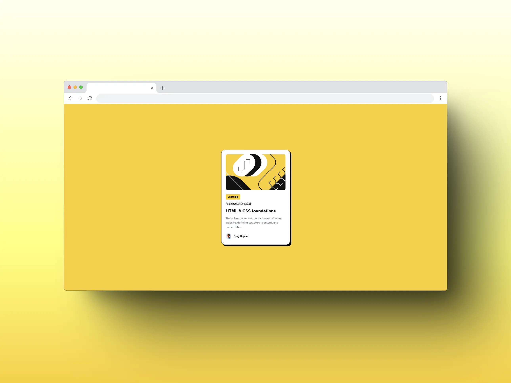

# Frontend Mentor - Blog preview card solution

This is a solution to the
[Blog preview card challenge on Frontend Mentor](https://www.frontendmentor.io/challenges/blog-preview-card-ckPaj01IcS).
Frontend Mentor challenges help you improve your coding skills by building
realistic projects.

## Table of contents

- [Overview](#overview)
  - [The challenge](#the-challenge)
  - [Screenshots](#screenshots)
  - [Links](#links)
- [My process](#my-process)
  - [Built with](#built-with)
  - [What I learned](#what-i-learned)
  - [Useful resources](#useful-resources)
- [Author](#author)

## Overview

### The challenge

Users should be able to:

- See hover and focus states for all interactive elements on the page

### Screenshots

### Links

- Solution URL: [This repo](https://github.com/Sir-M4kU/blog-preview-card)
- Live Site URL: [Blog Preview Card](https://blog-preview-card-8e4.pages.dev/)

## My process

### Built with

- Astro
- Tailwind CSS

### What I learned

- CSS Box Shadow

### Useful resources

- [Fontsource](https://fontsource.org/) - Great resource for free fonts
- [Shots](https://shots.so/) - Great tool for making mockups
- [Box Shadow Generator](https://www.cssmatic.com/box-shadow) - Tool for generating
CSS box shadows

## Author

- Frontend Mentor - [@Sir-M4kU](https://www.frontendmentor.io/profile/Sir-M4kU)
